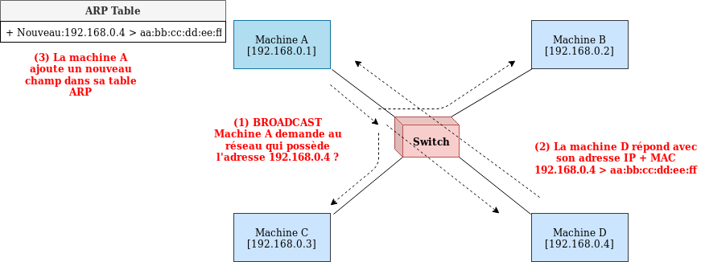
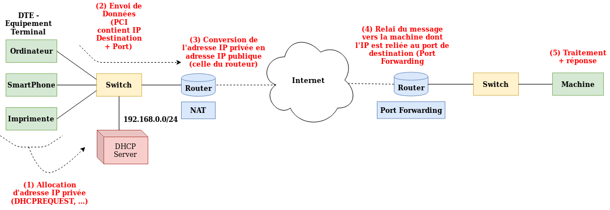
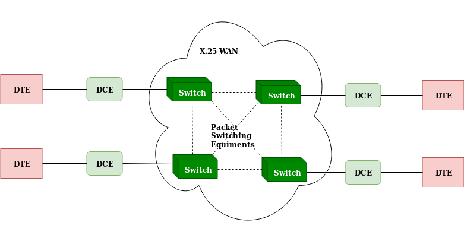
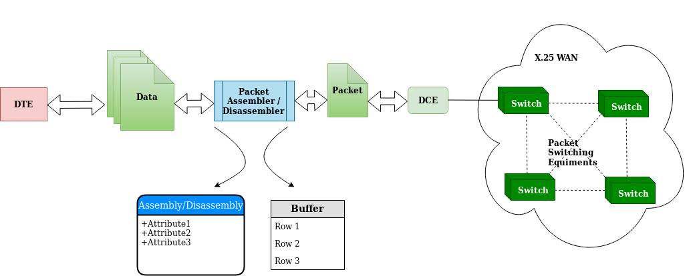
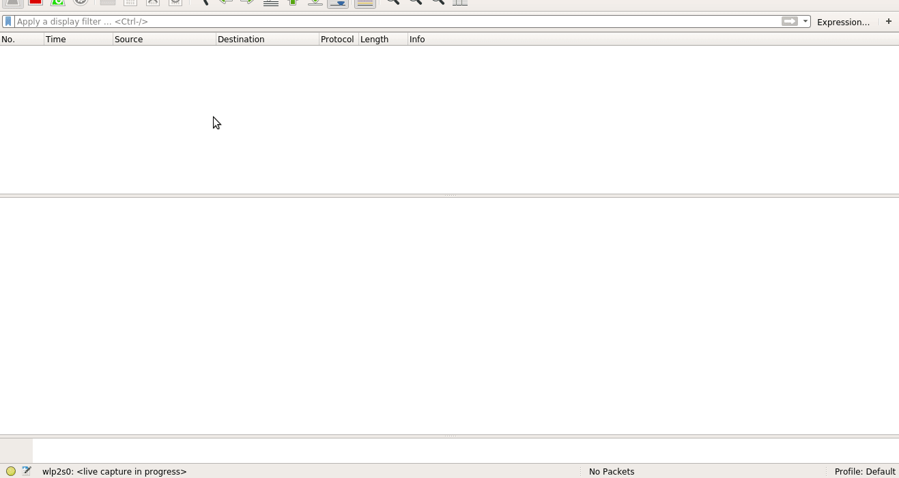
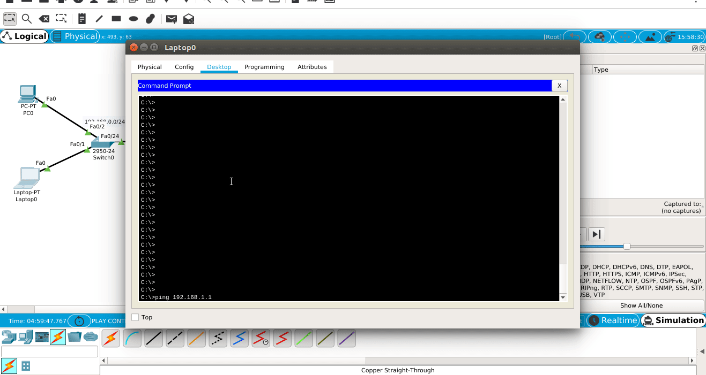

# reseaux-protocoles-exam-21
Repertoire pour stocker les differents fichiers relatifs à l'examen de Reseaux et Protocoles 2019.

----------------------------------------------------------------------------------------------------
## Machines d'état

##### Protocole X.25
X.25 est un protocole anciennement utilisé dans les réseaux à commutation de paquets PSN - Packet Switched Network, avant l’avènement des réseaux à protocole IP - Internet Protocol.

Il sert à relier DTEs - Data Terminal Equipments, et DCEs - Data Circuit-terminating Equipments, avec généralement des équipements PSE - Packet Switching Exchange, qui servent à convertir les données en paquets.

##### ARP - Address Resolution Protocol

##### IP - Internet Protocol

----------------------------------------------------------------------------------------------------
## Illustration du Fonctionnement

##### Protocole X.25
Le protocole X.25 est un protocole ancien qui très peut utilisé dans les architectures modernes, ceci entraine que l’on ne trouve pas son implémentation sur les logiciels de simulation (sauf les logiciels propriétaires). Voici donc une explication de son fonctionnement à l’aide de schémas et graphiques :

##### ARP - Address Resolution Protocol
Nous allons utiliser le sniffer WireShark pour visualiser les requêtes echangées entre une machine A qui se connecte à un réseau LAN, et les machines de ce réseau pour découvrir à qui appartiennent les adresses IP. Au fur et à mesure du processus, la machine A remplira une table ARP qui reliera les adresses MAC des machines du réseau à leur adresse IP privée.

_N.B._: Le protocole ARP fait le pont entre les couches 2 `Liaison` et la couche 3 `Réseau`.

Les commandes Linux suivantes permettent d'intéragir avec la table ARP :
- Visualiser la table : `$ arp [-e]`
- Ajouter une entrée : `$ arp -s <ADRESSE-IP-LOCAL> -i <NOM-INTERFACE> <ADRESSE-MAC>`
- Supprimer une entrée : `$ sudo arp -d <ADRESSE-IP>`

Animation :

##### IP - Internet Protocol
Nous allons utiliser le logiciel Cisco Packet Tracer pour simuler l'utilisation de la couche 3 du modèle OSI. Voici une animation qui montre le passage d'un paquet issue d'un `ping` - protocole ICMP - allant d'une machine sur le réseau local de droite vers un serveur sur le réseau local de gauche en passant par plusieurs routeurs.

Animation :

----------------------------------------------------------------------------------------------------
### Structure de ce répertoire
- `gif-simulations` : Contient les differentes animations sous format GIF
- `packet-tracer-simulation-files` : Contient les fichiers de sauvegarde de Packet Tracer. N.B.: La version de Packet Tracer utilisée est __Packet Tracer 7.2 for Linux 64 bit__
- `png-diagrams` : Contient les fichiers PNG des differents diagrammes et schémas utilisés dans le compte-rendu.
- `xml-graphics` : Contient les fichiers XML de sauvegarde de la plateforme en ligne [Draw.io](https://www.draw.io/) qui permet de réaliser les diagrammes et schémas.