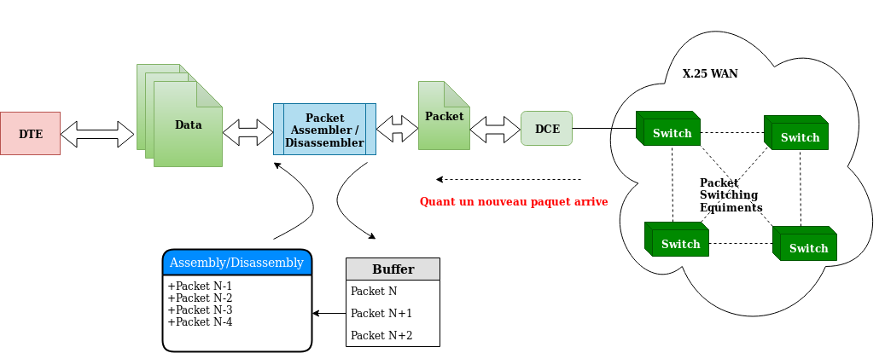

# Examen Réseaux et Protocoles 2019 - Variante 21
Ce répertoire contient le compte-rendu de l'examen, ainsi que les différents diagrammes, animations et simulations.

### Table des matières

----------------------------------------------------------------------------------------------------
## Machines d'état

### Protocole X.25
X.25 est un protocole anciennement utilisé dans les réseaux à commutation de paquets PSN - [Packet Switched Networks](https://en.wikipedia.org/wiki/Packet_switching), avant l’avènement des réseaux à protocole IP - _Internet Protocol_.

Il sert à relier DTEs - [Data Terminal Equipments](https://en.wikipedia.org/wiki/Data_terminal_equipment), et DCEs - [Data Circuit-terminating Equipments](https://en.wikipedia.org/wiki/Data_circuit-terminating_equipment), avec généralement des équipements PSE - [Packet Switching Exchange](https://en.wikipedia.org/wiki/Packet_switching), qui servent à convertir les données en paquets.

### ARP - Address Resolution Protocol

### IP - Internet Protocol

----------------------------------------------------------------------------------------------------
## Illustration du Fonctionnement

### Protocole X.25
Le protocole X.25 est un protocole ancien qui est très peut utilisé dans les architectures modernes, ceci entraine que l’on ne trouve pas son implémentation sur les logiciels de simulation. Voici donc une explication de son fonctionnement à l’aide de schémas et graphiques :

### ARP - Address Resolution Protocol
Nous allons utiliser le sniffer _WireShark_ pour visualiser les requêtes échangées entre une machine A qui se connecte à un réseau LAN, et les machines de ce réseau pour découvrir à qui appartiennent les adresses IP. Au fur et à mesure du processus, la machine A remplira une table ARP qui reliera les adresses MAC des machines du réseau à leur adresse IP privée.

_N.B._: Le protocole ARP fait le pont entre les couches 2 __Liaison__ et la couche 3 __Réseau__.

Les commandes Linux suivantes permettent d’interagir avec la table ARP :
- Visualiser la table : `$ arp [-e]`
- Ajouter une entrée : `$ arp -s <ADRESSE-IP-LOCAL> -i <NOM-INTERFACE> <ADRESSE-MAC>`
- Supprimer une entrée : `$ sudo arp -d <ADRESSE-IP>`

Animation :

### IP - Internet Protocol
Nous allons utiliser le logiciel Cisco _Packet Tracer_ pour simuler l'utilisation de la couche 3 du modèle OSI. Voici une animation qui montre le passage d'un paquet issue d'un `ping` - _protocole ICMP_ - allant d'une machine sur le réseau local de droite vers un serveur sur le réseau local de gauche en passant par plusieurs routeurs.

Animation :

## Protocole ICMP

### ICMP - Machine d'état et pricipe de fonctionnement
Voici un diagramme schématisant le principe de fonctionnement du protocole ICMP :

Voici la machine d'état corréspondante :

### ICMP - Illustration du fonctionnement

Nous allons utiliser le sniffeur _WireShark_ pour découvrir les paquets qui s'échangent entre deux machines lors d'un `ping` d'une machine vers une autre.

#### PING sur réseau LAN
On peut voir sur l'animation suivante comment interagissent les protocoles ICMP et ARP pour permettre à la requête de traverser le LAN dans les deux sens, allez-retour :

#### PING vers un nom de domaine sur un réseau distant
On peut voir sur l'animation suivante le processus préalable pour obtenir l'adresse IP d'une machine sur un réseau distant (requête DNS - _Domaine Name System_), puis l'échange de paquets ICMP entre les deux machines à travers la route établie :

### Relation entre ICMP et les autres protocoles

#### ICMP vs. X.25
Le protocole X.25 étant un protocole ancien main similaire au protocole IP, il est toujours possible d'utiliser les requêtes `ping` pour faire la découverte du réseau. Cependant dans les architectures modèrnes, le protocole X.25 est implémenté au dessus du protocole TCP, dénommé _X.25 Over TCP_.

#### ICMP vs. ARP
Lorsqu'on souhaite faire un `ping` vers une machine sur le même LAN, il faut connaître l'adresse MAC de celle-ci, c'est pourquoi on a recours au protocole ARP. L'animation [ci-dessus](https://github.com/redouane-dev/reseaux-protocoles-exam-21#ping-sur-réseau-lan) démontre cette relation.

#### ICMP vs. IP
Le protocole ICMP fait partie de la couche réseau du modèle OSI, et de ce fait il nécéssite l'utilisation des adresses IP pour que les requêtes `ping` arrivent à leur destination et reviennent à leur origine (que ce soit sur réseau LAN ou entre des machines sur deux réseaux distants). Les animations ci-dessus démontrent cette interaction.

N.B.: On peut toujours faire un `ping` vers l'adresse __broadcast__ du réseau (e.g. 192.168.0.0 pour le réseau LAN 192.168.0.0/24) en utilisant la commande suivante :
- `$ ping -b 192.168.0.0`

----------------------------------------------------------------------------------------------------
### Structure de ce répertoire
- `gif-simulations` : Contient les différentes animations sous format GIF
- `packet-tracer-simulation-files` : Contient les fichiers de sauvegarde de Packet Tracer. N.B.: La version de Packet Tracer utilisée est __Packet Tracer 7.2 for Linux 64 bit__
- `png-diagrams` : Contient les fichiers PNG des différents diagrammes et schémas utilisés dans le compte-rendu.
- `xml-graphics` : Contient les fichiers XML de sauvegarde de la plateforme en ligne [Draw.io](https://www.draw.io/) qui permet de réaliser les diagrammes et schémas.